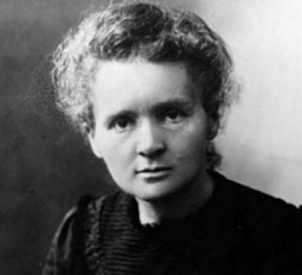

[Brief](brief.md) | [Biografie](biografie.md) | [Radium](radium.md) | [Bronnen](bibliografie.md) | [Tijdlijn](https://cdn.knightlab.com/libs/timeline3/latest/embed/index.html?source=1E-iVJlxIhEdE5K3mXC_vnQod_FRKKTVz-mWdT42EE0s&font=Default&lang=nl&initial_zoom=2&height=650) |  [Presentatie](https://gitpitch.com/bloemenmeisje/MarieCurie/master?grs=github&t=moon)

# Biografie van Marie Curie

Het leven van Marie Curie zit boordevol gebeurtenissen. Je zou bijna zeggen dat het een legende is.

## januari opstand in 1863

De januari-opstand in 1863, ook wel powtanie styczniowe genoemd, was de grootste poolse opstand van de negentiende eeuw. Er waren enorm veel mensen bij betrokken. De plattelandsbevolking, de boeren, studenten en enkele politici en Poolse legerofficieren gingen tegen de Russische bezetter in. er waren ongeveer 200.000 mensen die in opstand kwamen, waarvan ongeveer 20.000 tot 30.000 echt een gewapende strijd voerden.
De directe aanleiding voor deze opstand was de invoer van dienstplicht, door Alexander Wielopolski, voor de jonge Poolse mannen in het leger van Rusland. De opstand liep uit op een mislukking, de Poolse opstandelingen haalden geen enkele overwinning binnen.
De opstand begon op 22 januari 1863 en eindigde in 1865, nadat de laatste mensen waren gearresteerd.

## Gevolgen van de opstand

### Negatieve gevolgen:
     

-  Er werd geen enkele overwinning behaald.

-  Er vielen duizenden doden tijdens deze strijd.

-  Er werd wraak genomen door de Russen: Er vonden openbare executies plaats en gevangenen werden naar Siberië gedeporteerd.

### Positieve gevolgen:

-  Door de afstandelijke sfeer waren er wel eerlijkere maatschappelijke verhoudingen voor de boeren afgedwongen. Dit was later ook de start om een definitieve omvorming van de sociale verhoudingen te komen, zoals de afschaffing van de lijfeigenschap van Poolse boeren.

-  Poolse nationalisten gingen na de mislukte opstand geen heil meer verwachtten in  revolutionaire acties. Dit deed  de situatie van Polen alleen maar slechter worden. Men ging zich volledig toeleggen aan allerlei veranderingen. Niet alleen voor de boeren, maar ook voor de vrouwen en de Joden in Polen vonden er veranderingen plaats, deze mensen werden steeds meer maatschappelijk betrokken.

## Jeugd

Marie Curie werd geboren als Marya Sklodowska is geboren op 7 november 1867 in Warschau. Ze was de jongste van 5 kinderen,haar moeder gaf hen thuis de kennis de ze moesten weten om verder te kunnen. Hun vader daarentegen was een leerkracht Natuurkunde en Wiskunde in een middelbare school. Marie was een gezond,eerlijk,gevoelig,opgewekt en enorm begaafd meisje.
Het werk van haar vader werd een aantal keer zwaar verstoord door de opstanden van de Poolse gemeenschap tegen de Russische bezetting van Polen. De Russen zagen Polen als een Russische provincie en hierdoor werd het onderwijs verplicht in het Russisch gegeven na een mislukte opstand. De hogere posities werden alleen nog maar ingenomen door Russen en geen enkele Pool kwam nog in aanmerking voor de hogere posities.
Haar moeder verdiende geld bij een middelbare school als directrice te zijn in een school waarin na enige tijd tyfus uitbrak.
Haar oudste zus kreeg deze verschrikkelijke ziekte en stierf hieraan toen Marya 8 jaar was.
2 Jaar later stierf haar moeder aan tuberculose. Deze tragedies overschaduwden de armoede in het gezin.

Ze ging naar een school die beheerd werd door de Russen. Er kwam een inspecteur langs om te zien of de regels wel werden nagestreefd. Hierop vond deze school echter een oplossing, ze vonden een systeem met belletjes zodat ze net genoeg tijd hadden om boeken over Polen en Poolse cultuur weg te steken en hun naaiwerk boven te halen. Telkens als de inspecteur, binnenkwam moest een leerling in het Russisch het "Onze Vader" opzeggen. Omdat Marie goed was in Russisch, werd zij altijd uitgekozen waarna ze na een tijdje bang werd van de inspecteur en de Russen.
Op 15-jarige leeftijd verlieten zij en haar zus Bronya de middelbare school met zeer hoge cijfers.
Ze werd in 1883 geweigerd aan de Keizerlijke Universiteit van Warschau. In die tijd was het onmogelijk om als vrouw te mogen gaan studeren en een beurs te krijgen, dus moesten ze zelf alles zien te bolwerken. Het onderwijs was sinds de mislukte januariopstand in 1863 namelijk ‘gerussificeerd’, waardoor vrouwen voortaan geen toegang meer hadden. Zij en haar zus(Bronya) gingen naar de "vliegende universiteit" om meer kennis op te doen. De "vliegende universiteit" was een plek waar jongeren hun kennis uitwisselden zonder dat de Russen er iets van wisten.
Op 18-jarige leeftijd gaf ze haar zorgeloze leventje op, om haar droom achterna te gaan, studeren aan de universiteit werd haar grote doel. Ze ging als gouvernante werken op een suikerriet plantage, om zo genoeg geld te kunnen verdienen dat zowel zij als Bronya naar de Sorbonne konden( universiteit Parijs).Toen ze genoeg geld hadden voor 1 persoon te kunnen laten overvliegen, kozen ze ervoor om Bronya als 1ste te laten gaan om arts te worden. Van 1886 tot 1889 ging Marie als privélerares werken in Szczuki om haar zus, die op dat moment in Parijs medicijnen studeerde, financieel te kunnen bijstaan. In 1891 verhuisde Marie zelf ook naar Parijs om daar scheikunde, natuurkunde en wiskunde te gaan studeren. Dit was met behulp van het loon van Bronya maar ook haar eigen loon.

## Vrouwen mochten in die tijd niet studeren, waarom niet?

Er waren allerlei 19de eeuwse theorieën die ze bedachten. Ze zagen vrouwen als minderwaardig:

- vrouwen hebben minder hersenen dan mannen.

- vrouwen kunnen niet rationeel denken.

- teveel wetenschap in hun hoofd maakt hen ongeschikt voor moederschap.

Later werden vrouwen wel toegelaten aan universiteiten, maar het was verplicht om een neerbuigende houding aannemen.
Bv : Hertha Ayrton ( zij was een goede vriendin van Marie ) was de eerste vrouw die een lidmaatschap kreeg aan de Royal Society maar werd heel vaak afgewezen.
Ze kreeg voor deze titel weinig waardering.

## Studententijd

Op 24-jarige leeftijd werd ze toegelaten op de Sorbonne. Ze verhuisde naar een klein zolderkamertje waar ze met weinig geld moest zien te overleven. Ze had genoeg maar net genoeg geld voor, of eten of verwarming. Dus voor de warmte en het licht bleef ze zo lang mogelijk in de bibliotheek zitten, zodat ze het geld dat ze kreeg kon gebruiken voor voedsel.
In 1893 was ze de beste van haar jaar voor Natuurkunde. Het jaar daarop was ze 2de voor Wiskunde. Ze werd hiervoor beloond door een kleine beurs te krijgen zodat ze onderzoek kon doen naar het magnetisme. Ze kreeg het advies om hulp te vragen aan de directeur van de school voor Industriële Fysica en Chemie ( Pierre Curie 1859-1906).

## Carrière en gezin

In 1895 trouwden Marya (Marie noemde ze zichzelf) en Pierre Curie, ze hielden veel van elkaar en dit kwam ook tot uiting in het laboratorium.
Voor hun huwelijk kregen ze van de ouders van Pierre 2 fietsen. Hun enige ontspanning was dan ook lange fietstochten door het platteland.
Ze kregen samen 2 kinderen, Eve en Irène. Bij Eve' s geboorte was Marie 37 jaar,dat betekende dat, als Eve groot werd haar moeder als het ware een belangrijke vrouw was en beroemd, Marie daarentegen vond dit niet belangrijk en gedroeg zich als de andere mensen van het volk. Ze waren een hecht gezin tot Pierre Curie overleed. Dit was als een messteek in het hart van het gezin.

Toen Marie Curie beroemd was zei Einstein: "Marie Curie is de enige van de beroemde mensen die niet bedorven is"

### De ontdekking van Radium.

Marie sloot het onderzoek naar magnetisme af en begon onderzoek te doen naar uraniumstralen, die Becquerel al had ontdekt. 
Marie dacht aan nog andere uranische straling behalve de bestaande 3. Want allerlei chemische behandelingen en temperatuurverschillen gaven geen effect op de straling zelf.
Voor haar had dit alles te maken met de atomen zelf.
Ze ontdekte dat dit een eigenschap was van een atoomkern en gaf de naam radioactiviteit aan dit fenomeen. De stralingseigenschap van Radium, Polonium en Thorium noemde ze radioactiviteit.

Maar dat was voor haar niet alles, ze wist namelijk dat er nog een stof binnenin de pekblende zat die 4000 x krachtiger was.
Na ellenlange zuiveringsprocessen ontdekt ze een bepaalde stof namelijk Radium.
Dit is de **meest beroemde** ontdekking van Marie in 1898.
Toch zijn heel wat mensen zeer argwanend over haar werk, omdat er in al haar werk, ontdekkingen gedaan werden die toch niet helemaal oké waren.
Om het element Radium echt te kunnen vaststellen, hadden de Curies een groot en vooral zuiver genoeg monster nodig. 
Dit kregen ze pas, door 7000 kg pekblende uit te zuiveren, tot ze bij 0,14 gram zuivere Radium uitkwamen. Die pekblende kregen ze met hopen van de mijnen in Bohemen (Oostenrijk). Ze konden namelijk niets doen met de pekblende.
Heel het zuiveringsproces om tot zuivere Radium te komen, duurde 3 jaar.
In 1910 lukte het Marie om Radium te isoleren.

#### Beloning ontdekking radium

Marie werd door deze ontdekking hoofd van het Natuurkundig laboratorium van de Sorbonne. 
Na het overlijden van Pierre in 1906 kreeg Marie de leerstoel,waarna ze ook werd benoemd tot lector. Ze was de eerste vrouwelijke hoogleraar aan de Sorbonne.

#### Geschreven boeken en 1ste W.O.

In 1910 schreef Marie het 2-delige " verhandeling over radioactiviteit". Marie 
definieerde ook de eenheid voor radioactiviteit, genaamd Curie; vernoemd naar zichzelf en Pierre Curie.
In 1914 brak de 1ste W.O.uit en gingen Marie en Irène (haar oudste dochter) met behulp van een eigen ontdekking in de westhoek de gewonde soldaten aan de frontlinie onderzoeken. Dit was met behulp van haar zelf ontworpen autobusjes:"ambulances radiologiques"(autobusjes voorzien van een dynamo en een röntgenapparaat).Later werd dit "les petites Curies" genoemd.

#### Laatste levensjaren

In 1914 werd het Radiuminstituut opgericht aan de Universiteit van Parijs, waar Curie directeur van werd. Een tweede Radiuminstituut richtte Curie in 1932 in Warschau op. Ze bleef directeur van het Radiuminstituut tot haar dood. Ze overleed in 1934 aan leukemie door een teveel aan straling. Dit zal waarschijnlijk ook de dood van Pierre hebben veroorzaakt.
Ze werd naast haar man in het Sceaux begraven. In 1995 werd ze en haar man overgebracht naar het Panthèon.
Dit gebeurde in een loden kist omdat ze allebei zo radioactief geladen waren. Het zou onveilig geweest zijn ze gewoon te vervoeren.

## Prijzen

- Hun eerste Nobelprijs wonnen ze in 1903 voor de Natuurkunde "Voor hun onderzoek naar stralingsfenomenen ontdekt door Henri Becqurerel".
- Ze kreeg in 1911 haar 2de Nobelprijs.
- Haar dochter Irène kreeg een Nobelprijs voor de Scheikunde, in 1935.

Hun familie heeft 5 Nobelprijzen in totaal binnengehaald.

## alles even op een rijtje

De Curies hebben nooit geen patent gevraagd voor hun technieken om Polonium en Radium te winnen. 
Daarom was het winnen van de Nobelprijs in 1903 zo belangrijk omdat er ook een serieus prijskaartje aan vasthing.

- 1867 : geboorte Marie Curie

- 1875 : overlijden oudste zus Marie Curie

- 1877 : Overlijden van haar moeder aan tuberculose

- 1882 : verlaat school met hoge cijfers

- 1882-1885 : gaat naar de "vliegende universiteit"

- 1885 : wordt gouvernante

- 1891 : wordt toegelaten aan de Sorbone.

- 1892 : beste van haar jaar in Natuurkunde

- 1893 : 2de beste van haar jaar in Wiskunde en krijgt kleine studiebeurs

- 1895 : Trouwt met Pierre Curie

- 1887 : geboorte dochter Irene Curie

- 1904 : geboorte dochter Eve Curie

- 1906 : Pierre Curie overlijdt na een fataal ongeluk met paard en wagen.
Ondank zijn slechter wordende gezondheid en verstrooidheid, geloofde Pierre wel in de genezende kracht van Radium.
Marie was radeloos van verdriet !
Ze zoekt verder naar technieken om een bepaalde standaard te bereiken met Radium, om zo bepaalde ziektes ( zweren, lupus, reuma... )
te kunnen genezen.

- dec 1906 : Marie wordt benoemd tot 1ste vrouwelijke hoogleraar aan de Sorbonne in Parijs.

- 1910 : Marie publiceert de " Verhandeling van de Radioactiviteit. Op dat zelfde moment komt haar relatie met Paul Langevin in de openbaarheid.
Mede daardoor kreeg ze geen benoeming aan de Academie van de Wetenschappen.

- 1911 : 2de Nobelprijs voor de Scheikunde
Ze kreeg de mogelijkheid om les te gaan geven in Polen, maar daar bedankte ze vriendelijk voor. 
Ze ging wel naar Warschau om een labo voor onderzoek naar radioactiviteit te openen.
In Parijs wordt er het Radiuminstituut opgericht. Marie wordt er directeur. Tijdens die periode reisde ze 2 maal naar de Verenigde Staten om geld bij elkaar te sprokkelen voor dat instituut.

- 1913 : Marie ontvangt het eredoctoraat aan de universiteit van Birmingham.

- Tijdens W.O. I runt ze samen met haar dochter Irene een mobiele röntgenfotodienst.

- 1926 : Irene Curie huwt met de assistent van Marie Curie : Frederic Joliot.

- 1934 : Marie overlijdt aan de gevolgen van leukemie. Waarschijnlijk had het werken met straling een effect op Marie' s gezondheid.

- 1995 : overgebracht naar het Panthèon.
