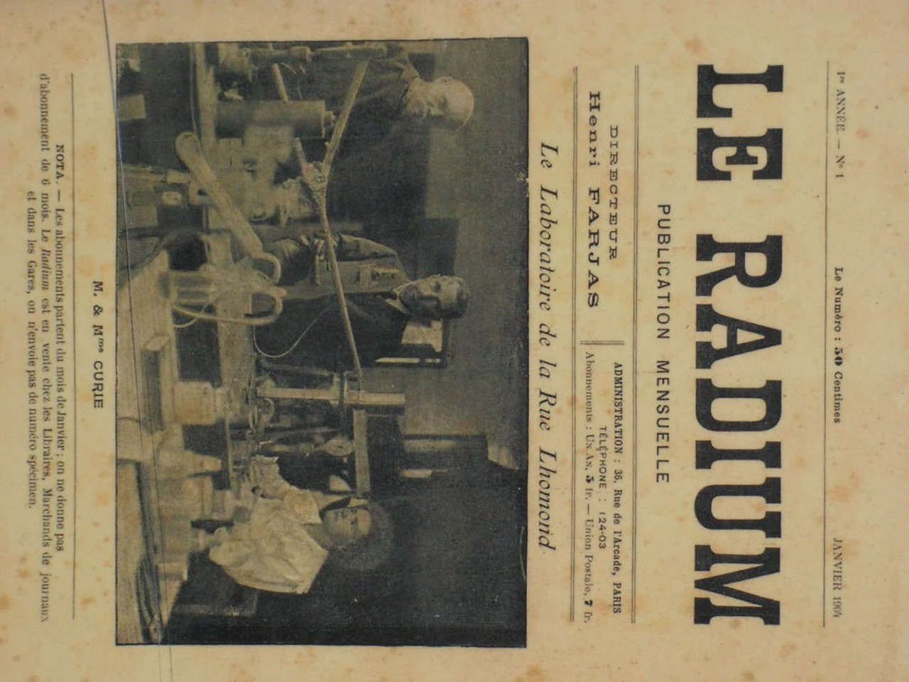

[Vorige](hfst11_marie_curie.md) | [Inhoud](inhoudsopgave.md) | [Volgende](hfst13_4_jaren_in_de_schuur.md)

LEESTAAK - SAMENVATTING

TWEEDE DEEL

---

## Hoofdstuk 12 : Radium

Ondertussen is het 1897 en Marie heeft het enorm druk. Ze is een jonge moeder en ze wil, onder invloed van Pierre, helemaal gaan voor haar doctoraat. Marie is ook wie ze is en wil zijn zoals een ontdekkingsreiziger. Ze wil dus gaan in gebieden waar niemand nog nooit geweest is. Ze vindt een compleet nieuw veld van onderzoek in een verhandeling van Henri Becquerel. Hij was een experimentele natuurkundige die ontdekte dat uranium-zouten spontaan licht verspreidde. Marie is geinteresseerd in de oorsprong van die stralen.

Ze moet dan op zoek naar een lokaal waar ze proefnemingen kan doen. Dat is niet zo gemakkelijk te vinden. Ze krijgt een afgesloten werkplaats zonder enig comfort. Maar ze probeert toch alles op alles te zetten om haar onderzoek te kunnen voeren. Het is er moeilijk werken want sommige van haar instrumenten weigeren dienst omdat het te koud is in het lokaal.

Ze is erg gedreven om de ontladingskracht van uranium te onderzoeken . Ze wil het vermogen ontwikkelen om de lucht tot een geleider van elektriciteit te maken en zo een elektroscoop te ontladen. Die elektroscoop werd uitgevonden door de gebroeders Curie !

Na enkele weken hard werken boekt ze resultaat. Marie vindt de resultaten zeer opwindend.  De kracht van de vreemde uitstraling is de hoeveelheid uranium in de stof en dat wordt niet beïnvloed door temperatuur of belichting.

Marie begint onmiddellijk met de bestudering en onderzoek van alle scheikundige elementen. En ze ontdekt dat in thorium ook straling aanwezig is. Ze zoekt dan een nieuwe naam voor deze nieuwe eigenschap = RADIOACTIVITEIT. Het is een boeiende tijd voor Marie.

Dan gaat ze verder in haar onderzoek en ze begint de volledige verzameling mineralen van de School Voor Fysica compleet te bestuderen en te onderzoeken met een elekrometer. Ze doet dat samen met Pierre. Ze onderzoeken alle gemakkelijke mogelijkheden en alle onbekenden. Ze ontdekken dat alle monsters die thorium en uranium bevatten, radioactief zijn. Alle monsters zonder die eigenschappen zijn niet-radioactief. Daarnaast ontdekt ze ook dat de radioactiviteit veel sterker is dan ze gedacht hadden. Marie en Pierre beslissen dan dat er nog een stof aanwezig moet zijn in de monsters, een stof die nog sterker is dan thorium en uranium.

Ze vertelt aan haar zus, Bronia, over haar geweldige ontdekking. Het is dus duidelijk dat er nog een ander natuurkundig element bestaat. In deze brief klinkt Marie helemaal anders dan in de haar beginjaren in Parijs, waar het leven zo moeilijk was. Haar doorzettingsvermogen en zelfvertrouwen hebben voor Marie geleid tot dit moment.

 <figure>
  
</figure> 

Voor dit werk en haar ontdekking krijgt ze een vermelding tijdens een zitting van 12 april 1898 aan de Académie des Sciences.

De titel van het stuk luidt : “ Er zijn 2 mineralen ontdekt in uranium : pekblende en chalcoliet.” Deze stoffen zijn allebei veel actiever dan uranium zelf. In deze mineralen zit een stof die actiever is dan uranium. Daar zal haar onderzoek nu verder om draaien, Ze wil die stof ontraadselen, door het nemen van proefnemingen en die zullen leiden tot bewijs. In heel dit proces krijgt Marie hulp van haar man, Pierre. Samen besteden ze 8 jaar lang van hun tijd in de kleine, vochtige werkplaats waar ze niets anders doen dan samen notities nemen, samen onderzoekingen doen en ze vormen samen daarin een geweldig team.

Ze gaan op zoek naar de radioactieve stof in de onbewerkte pekblende. Hun onderzoek bestaat erin dat ze alle lichamen in de pekerts gaan scheiden en dan in elke stof apart de radioactiviteit gaan meten.  Het resultaat beschrijven ze in een verslag van 1 juli 1898 : de abnormale radioactiviteit zit alleen in 2 chemische delen van de perkerts. Zo worden er 2 nieuwe stoffen ontdekt die allebei een naam moeten krijgen. Het eerste krijgt de naam Polonium, omdat Marie een Poolse is.  In december 1898 benoemen ze het 2de chemische element : Rradium.

Ondertussen gaat het leven en de noeste arbeid verder. In de zomer nemen ze dan een beetje vakantie in Auvergne, om hun batterijen weer wat op te laden. Ze geniet van de zomer, maar tegelijkertijd is er ook droefheid. Haar geliefde zus, Bronia verhuist naar Polen om daar een sanatorium op te richten voor TBC-patiënten. Marie is trots op haar zus, maar ze voelt ook de leegte, omdat haar beste vriendin nu weg is.
