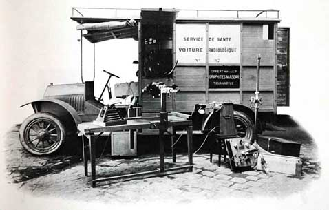

[Vorige](hfst20_succes_beproeving.md) | [Inhoud](inhoudsopgave.md) | [Volgende](hfst22_vrede_vakantie_larcouest.md)

LEESTAAK - SAMENVATTING

DERDE DEEL

---

## Hoofdstuk 21 : De oorlog

Marie wil in augustus 1914 een villa huren in Bretagne om daar vakantie te houden. Marie stuurt Iréne en Eve, samen met een gouvernante en een keukenmeid al voorop omdat ze haar werk eerst wil afronden. Maar de gebeurtenissen volgen elkaar op en Marie informeert haar dochter met lange brieven.

1/8/1914 : “ Er zijn problemen. De mobilisatie is in aantocht. Het gaat me misschien niet lukken om naar Bretagne te komen.”

2/8/1914 : “ De mobilisatie is begonnen. De Duitsers zijn binnengedrongen in Frankrijk”.

6/8/1914 : “ Ik kan onmogelijk komen. De Duitsers overspoelen België en Polen. Ik maak me ook zorgen over mijn familie daar. “

Er ontstaat een grote leegte rond Marie, want al haar medewerkers gaan in het leger. En Marie voelt de drang om iets te doen voor haar tweede vaderland. Ze hoort het nieuws dat de hospitalen achter het front een tekort hebben aan Roentgen-stralen.  En Marie weet daar wel wat over.  Ze wil graag een licht, mobiel, radiologisch instrument ontwikkelen. En dat wordt een groot succes. Dan besluit Marie in Parijs te blijven. Iréne en Eve worden ondergebracht bij Jacques Curie.
Opnieuw schrijft ze brieven naar haar geliefde dochters.

28/8/1914 : “ Parijs wordt belegerd. Irene, wil jij goed voor je zus zorgen ?”

29/4/1914 :  “ Bereid je voor op alles, Iréne! “

31/8/1914 :  “ Het is een moeilijke tijd, maar je moet blijven hopen.”

Marie besluit om haar gram Radium naar Bordeaux te brengen om het op die manier te beschermen tegen de Duitsers. Ze neemt de trein, plaatst het Radium in een safe in een bank en keert terug naar Parijs.
Dan gaat Marie in de Hogere Normaalschool 2 vrienden opzoeken om hen bij te staan in hun werk.

Nieuwe brief aan Irene : 

6/9/1914 :  “ de vrijand trekt weg uit Parijs. Maar studeer zoveel mogelijk Wiskunde en Natuurkunde als je kan, voor de toekomst van Frankrijk. “

De meisjes keren terug naar Parijs, waar Eve terug naar school gaat en Irene haar verpleegstersdiploma haalt.

 <figure>
  
</figure> 

Vanaf dan zijn de mobiele Rontgen-apparaten er. Ze worden ook wel de “kleine Curies” genoemd.
Marie jaagt iedereen op, want ze vindt dat er meer moeten komen. Ze is hardnekkig bezig met de vooruitgang van dit project. Heel wat rijke vrouwen snellen haar ter hulp, geven hun limousines af en ook 1 Renault. Die houdt Marie voor zichzelf en ze vertrekt naar het front om daar foto’s te gaan nemen van de gewonde soldaten. Ze wordt een grote hulp voor dokters in de hospitalen. Ze werkt dagenlang. De 20 auto’s rijden rond, maar er worden ook 200 radiologische zalen ingericht. Op die manier worden er +/- 1 miljoen gewonde soldaten geholpen.

 <figure>
  
</figure> 

Op 1 januari 1915 schrijft ze in een brief aan Paul Langevin dat ze alles in het werk wil stellen voor deze radiologische units. Midden januari bevindt ze zich aan het front in Amiens en Poperinge. In april 1915 komt Marie met een slecht humeur thuis, want 1 van de radiologische auto’s is kapot, maar drie dagen later is ze terug op pad.

Ook Irene begint iets van radiologie te kennen en ze wordt het hulpje van Marie, later zal ze eigen opdrachten uitvoeren.
Marie is zo vol van haar werk dat ze haar prijzengeld bij de Nobelprijs aan Frankrijk geeft. Tijdens al haar werk in de oorlog, verhuist Marie ook nog aan laboratorium naar het nieuwe radiuminstituut. Ze gaat opnieuw naar Bordeaux om de gram terug te halen.
Ze gaat ook samen met Irene lesgeven over radiologie en samen leiden ze een 150-tal technische helpers op. Ook gaat ze naar Belgische hospitalen om de radiologie te ondersteunen en ze leidt 20 Amerikanen op in de radioactiviteit. Door deze jobs, komt ze in contact met heel wat mensen waaronder koning Albert van België en zijn vrouw, Elisabeth.

Marie is altijd lief en zorgzaam voor haar patiënten, ze is altijd goedgehumeurd maar er sluimert ook een droefenis in haar. Ze maakt zich zorgen over haar familie.
En dan komt in 1918 het heugelijke nieuws dat er wapenstilstand is. Er is een grote vreugde bij Marie omdat Frankrijk en Polen bevrijdt zijn. Maar ze maakt zich opnieuw zorgen over haar wetenschappelijk werk, dat door de oorlog, op de achtergrond is geraakt. Daar wil ze zich opnieuw aan gaan wijden.
