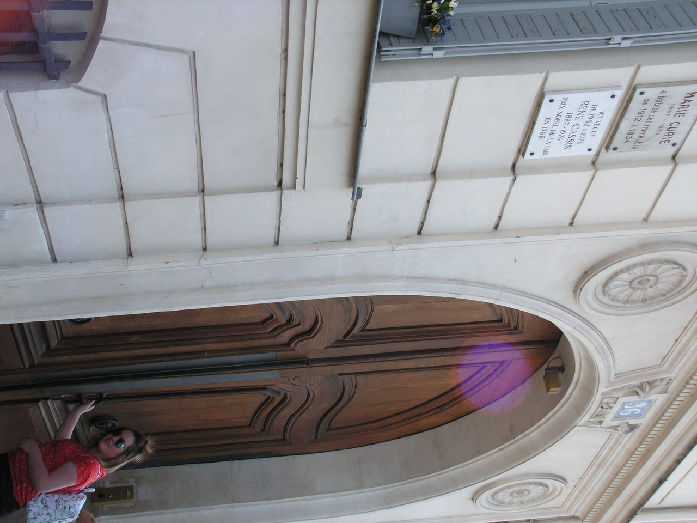

[Vorige](hfst24_volle_wasdom.md) | [Inhoud](inhoudsopgave.md) | [Volgende](hfst26_het_laboratorium.md)

LEESTAAK - SAMENVATTING

DERDE DEEL

---

## Hoofdstuk 25 : Ile Saint-Louis 

Marie wordt steeds meer overladen door roem, maar ze blijft altijd de vrouw die door werk overkropt is en eenvoudig zal voor de rest van haar dagen.

 <figure>
  
</figure> 

Ze koopt een appartement op Ile Saint-Louis, ze zal er uiteindelijk 22 jaar wonen. Ze is wel blij met deze plek, omdat ze goed genoeg weet hoe het is om arm te zijn. Ze vult de kamers met allerlei geschenken die ze krijgt van overal.( Vazen, schilderijen, tapijten ). 
In het hele appartement staat er welgeteld 1 eigen aankoop. Een vleugelpiano die ze cadeau doet aan Eve. 

Een kamer wil ze voor zichzelf en dat wordt haar eigen werkkamer. Die wordt volgepropt met boeken, oude meubels die nog toebehoorde aan de vader van Pierre en een portret van Pierre.

Marie heeft bij het appartement zelfs een dienstbode en een chauffeur. Die chauffeur brengt haar elke dag om 8.00 u stipt met de auto naar haar laboratorium. Ze hoeft eigenlijk niet meer te werken, want ze ontvangt een staatspensioen en een toelage vanuit de Verenigde Staten. Maar ze wil blijven werken.

Ondertussen bezit ze ook twee landhuizen : in Lancrouest en in Zuid-Frankrijk. Ze droomt ervan om daar te gaan genieten van de heerlijke rust, zon, zee en haar tuinen. Maar ze kan het werken niet laten.

In 1926 vertelt Irene haar dat ze verloofd is met Frédéric Joliot. Hij is een zeer gewaardeerde medewerker van het radiuminstituut. Marie is gelukkig voor Irene, maar ook dubbel gelukkig met haar welbespraakte en intelligente “schoonzoon “. Ze vindt dat ze een zoon bijkrijgt. De Joliots komen zeker 4 keer per week eten bij Marie en dan wordt er hevig gepraat over allerlei wiskundige en natuurkundige problemen. Enige tijd later wordt Marie ook grootmoeder van Hélène, wat haar veel vreugde geeft.

Vanaf dan woont ze alleen met Eve in het appartement. Als Marie thuiskomt van een lange werkdag, zitten ze samen te eten en wordt er veel gepraat. Die gesprekken gaan over heel veel verschillende onderwerpen bv : over haar werk, over Hélène, soms over politiek, over het tekort van ziekenhuizen en scholen in Frankrijk, over de weinige rechten die vrouwen nog steeds maar hebben, over de ongezonde woonomstandigheden van bepaalde mensen, soms ook over de liefde, maar dat is eerder oppervlakkig en onpersoonlijk.

Ze vertelt ook dat ze vaak aan haar broer en zussen denkt, maar ook aan Jacques Curie die haar zo nauw aan het hart ligt. Ze schrijft veel brieven aan Bronia, die haar man en haar 2 kinderen verliest.

Als het diner erop zit, kijkt ze vaak naar Eve, als die zich klaarmaakt voor een avondje uit. Ze geeft dan veel haar mening over de mooie japonnen die Eve draagt. Marie vindt dat allemaal niet nodig. Ook de schoenen van Eve vindt Marie raar. En wanneer Eve make-up begint te gebruiken, is ze totaal ongelovig. Ze begrijpt het niet dat Eve zich zo “verft”. Al die dingen zijn een brug te ver voor Marie.

Als Eve de deur uit is, begint Marie aan haar avondritueel. Ze gaat eerst wat lezen, maar na een halfuurtje ruilt ze die in voor wetenschappelijk werk. En vaak vindt Eve haar moeder om 2 of 3 u ‘s nachts op de grond, terwijl ze werkt met potlood en papier. En dat terwijl ze helemaal omsingeld is door allerlei wetenschappelijke boeken.
