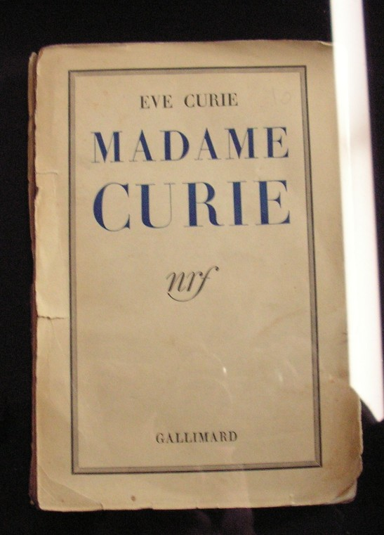
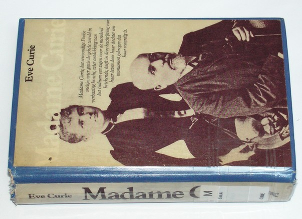
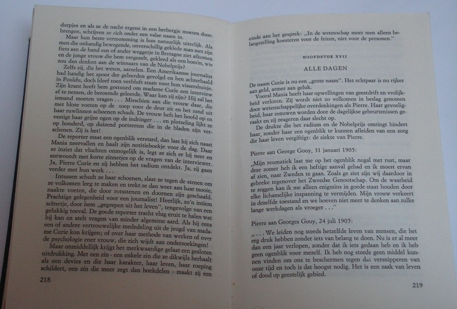

[Brief](../brief.md) | [Biografie](../biografie.md) | [Radium](../radium.md) | [Bronnen](../bibliografie.md) | [Tijdlijn](https://cdn.knightlab.com/libs/timeline3/latest/embed/index.html?source=1E-iVJlxIhEdE5K3mXC_vnQod_FRKKTVz-mWdT42EE0s&font=Default&lang=nl&initial_zoom=2&height=650) |  [Presentatie](https://gitpitch.com/bloemenmeisje/MarieCurie/master?grs=github&t=moon)

LEESTAAK - SAMENVATTING

---

# Madame Curie
door  ***Eve Curie***

 <figure>
  
</figure> 

Madame Curie, het eenvoudige Poolse meisje, wier genie de gehele wereld in verbazing, wier ontdekking van het radium een zegen voor de mensheid betekende, heeft in deze beschrijving van haar leven door haar dochter een monument gekregen dat haar waardig is.

Dit boek is boeiender dan menig roman. Bovenal komt er in tot uiting de grootsheid van haar karakter, haar bescheidenheid en haar doorzettingsvermogen. Het is een epos over een der grote figuren van de moderne tijd.

 <figure>
  
</figure> 

 <figure>
  
</figure> 

---

## Inhoud

### EERSTE DEEL

- [I. Mania](hfst01_mania_wordt_marie.md)
- [II. Sombere dagen](hfst02_sombere_dagen.md)
- [III. Meisjestijd](hfst03_meisjestijd.md)
- [IV. Roeping](hfst04_roeping.md)
- [V. Gouvernante](hfst05_gouvernante.md)
- [VI. De lange wachttijd](hfst06_de_lange_wachttijd.md)
- [VII. Vlucht](hfst07_vlucht.md)

### TWEEDE DEEL

- [VIII. Parijs](hfst08_parijs.md)
- [IX. Veertig roebel per maand](hfst09_40_roebel_per_maand.md)
- [X. Pierre Curie](hfst10_pierre_curie.md)
- [XI. Madame Curie](hfst11_marie_curie.md)
- [XII. Radium](hfst12_radium.md)
- [XIII. Vier jaren in een schuur](hfst13_4_jaren_in_de_schuur.md)
- [XIV. Het moeilijke leven](hfst14_het_moeilijke_leven.md)
- [XV. Een doctoraat en een gesprek van vijf minuten](hfst15_een_doctoraat.md)
- [XVI. Vijand Roem](hfst16_vijand_roem.md)
- [XVII. Alle Dagen](hfst17_alle_dagen.md)
- [XVIII. 19 april 1906](hfst18_april_1906.md)

### DERDE DEEL

- [XIX. Alleen](hfst19_alleen.md)
- [XX. Succes, beproeving](hfst20_succes_beproeving.md)
- [XXI. De oorlog](hfst21_de_oorlog.md)
- [XXII. De vrede. Vakantie in Larcouest](hfst22_vrede_vakantie_larcouest.md)
- [XXIII. Amerika](hfst23_amerika.md)
- [XXIV. De volle wasdom](hfst24_volle_wasdom.md)
- [XXV. Ile Saint-Louis](hfst25_ile_saint_louis.md)
- [XXVI. Het laboratorium](hfst26_het_laboratorium.md)
- [XXVII. Einde van de taak](hfst27_einde_taak.md)

