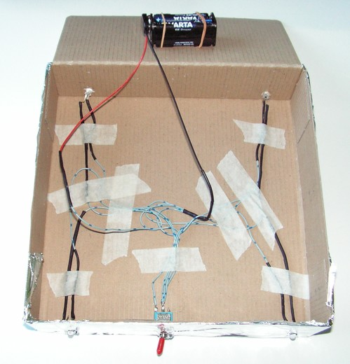

[Brief](brief.md) | [Biografie](biografie.md) | [Boek](boek/inhoudsopgave.md) |[Radium](radium.md) |[Bronnen](bibliografie.md) | [Tijdlijn](https://cdn.knightlab.com/libs/timeline3/latest/embed/index.html?source=1E-iVJlxIhEdE5K3mXC_vnQod_FRKKTVz-mWdT42EE0s&font=Default&lang=nl&initial_zoom=2&height=650) |  [Presentatie](https://gitpitch.com/bloemenmeisje/MarieCurie/master?grs=github&t=moon)

# practisch deel

Voor mijn practisch deel maak ik gebuik van een loden kistje met waarin ik mijnhoog radioactief materiaal in bewaar.

### beschrijving

Als je de doos opent kan je je best goed beschermen als het fel blauw - witte licht je tegemoed komt. in de doos bevinden zich zwaar radioactieve vervuilde documenten die pas na 1600 jaar voor de helft zo vervuild zullen zijn. Dit is de halfwaarde tijd van Radium.

Het licht uit deze doos komt natuurlijk niet van de straling maar wel van enkele ledjes( kleine lampjes). De kistje bevat dan ook een schakelaar en een batterij. Ik heb dit samen met mijn papa in elkaar gesoldeerd. 

###  Benodigtheden

- Kartonnen schoendoos
- crepepapier in de kleuren van lood
- lijm
- schaar
- aluminium folie
- batterijhouder
- 4 AA batterijtjes
- schakelaar
- weerstand (680 ohm)
- Krimpkous
- soldeerbout + soldeer
- ledjes (4)
