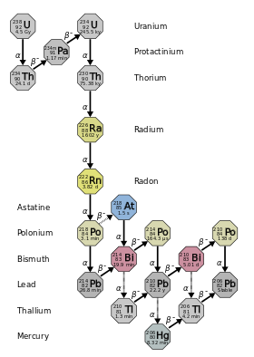
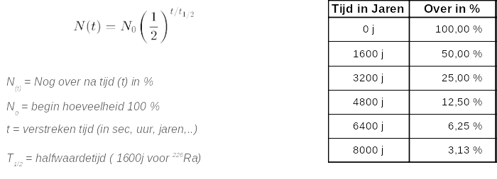

# Radioactief verval - halfwaardetijd

Het chemisch element radium (Ra), is niet stabiel en veranderd uit zichzelf tot een ander stof , radium zal nooit stabiel worden en steeds blijven veranderen. Met andere woorden, radium zal automatisch verdwijnen na verloop van tijd. Dit verdwijnen gebeurt door het uitzenden van deeltjes, we noemen dit radioactiviteit.

Er zijn verschillende soorten radium (isotopen), de kortstlevende soort radium is 199Ra, met een halfwaardetijd van ongeveer 2,6 milliseconden. De langstlevende is 226Ra, met een halfwaardetijd van 1600 jaar. Het is deze soort (isotoop), die in de vervalreeks van uranium-238 voorkomt, en in 1898 werd ontdekt door Marie Curie en haar man Pierre Curie.

Een kenmerk van radioactiviteit is dat de straling met de tijd afneemt. Dat regelt de natuur zelf. Hoe meer tijd er verstrijkt, hoe minder straling. Radium veranderd uit zichzelf na verloop van tijd in Radon. Dit is een natuurlijk proces dat we niet kunnen veranderen. In onderstaande figuur kan je zien dat Radium vervalt tot Radon, en daarna zal Radon weer vervallen tot andere elementen.

Hoe lang dat duurt, drukken we uit met halveringstijd. Dat is de tijd die nodig is om telkens de helft van de radioactiviteit kwijt te raken. Na twee halveringstijden is de radioactiviteit de helft van de helft. Dat is dus een kwart van de beginwaarde.

Iedere radioactieve stof heeft een eigen vaste halveringstijd. Voor de ene stof zijn dat secondes, voor andere stoffen zijn dat duizenden jaren. Het ene radioactieve stofje is dus meteen als het ontstaat al ongevaarlijk. Ander radioactief materiaal moet je vele duizenden jaren opslaan voor het ophoudt met stralen.

Radium is uiterst radioactief en het vervalproduct radon is een kleur- en geurloos radioactief gas. Doordat radium chemisch gezien veel overeenkomsten vertoont en in het lichaam verwisseld kan worden met calcium, kan het schade aanrichten als het wordt ingebouwd in botten. Daarnaast kan radium kankerverwekkend zijn. Bij het opslaan van radium is goede ventilatie een vereiste om te voorkomen dat er verhoogde concentraties van radon ontstaan. 
