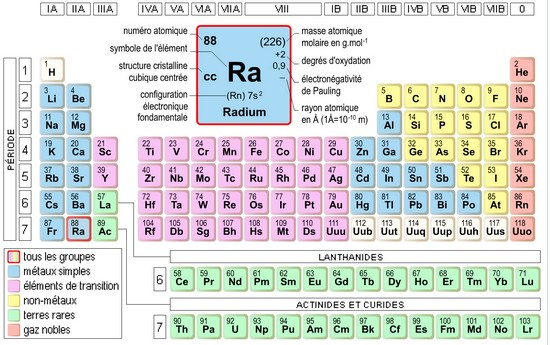

[Brief](brief.md) | [Biografie](biografie.md) | [Boek](boek/inhoudsopgave.md) |[Practijk](practisch_deel.md) | [Bronnen](bibliografie.md) | [Tijdlijn](https://cdn.knightlab.com/libs/timeline3/latest/embed/index.html?source=1E-iVJlxIhEdE5K3mXC_vnQod_FRKKTVz-mWdT42EE0s&font=Default&lang=nl&initial_zoom=2&height=650) |  [Presentatie](https://gitpitch.com/bloemenmeisje/MarieCurie/master?grs=github&t=moon)

# Radium

## beschrijving van radium

Radium is een scheikundig element met het symbool Ra en atoomnummer 88. Van Radium, Uranium, Plutonium en Thorium is radium de meest actieve stof. Het is een wit/zilverkleurig aardalkalimetaal(= een groep elementen uit het periodiek systeem die het gemeen hebben dat hun elektronenconfiguratie [X]ns2 is, waarbij [X] voor een edelgas staat. De twee elektronen in de buitenste s-subschil kunnen het atoom gemakkelijk verlaten waarbij de aardalkalimetalen tweewaardige kationen vormen).
Radium, de meest radioactieve stof, heeft een vervalproduct: radon, dit is een kleur- en geurloos radioactief gas. We noemen dit [radioactief verval](radioactiefverval.md).

## Kankerverwekkend

Doordat radium in de chemie  veel overeenkomsten vertoont met calcium, wordt dit wel eens verwisseld met radium in het lichaam. Hierdoor kan het grote schade aanrichten in het lichaam, als het wordt ingebouwd in botten. Radium kan ook kankerverwekkend zijn. Bij het opslaan van radium is goede ventilatie in het lichaam een verplichting om te voorkomen dat er verhoogde concentraties van radon ontstaan.

## eigenschappen

- Naam 	Radium

- Symbool : RA

- Atoomnummer : 88

- Groep : Aardalkalimetalen

- Reeks : Aardalkalimetalen

- Kleur : Zilverwit

## Chemische eigenschappen

- Atoommassa (u) : 226,03

- Elektronenconfiguratie : [Rn]7s2

- Oxidatietoestanden : +2

- Elektronegativiteit (Pauling) : 0,9

- 2e ionisatiepotentiaal (kJ·mol−1) : 979,06

- 1e ionisatiepotentiaal (kJ·mol−1) : 509,29

## Fysische eigenschappen

- Dichtheid (kg·m−3) : 5000

- Smeltpunt (K) : 973

- Kookpunt (K) : 1973

- Aggregatietoestand : Vast

- Kristalstructuur : Kub

- Molair volume (m3·mol−1) : 41,09 · 10−6

- Elektrische weerstand (μΩ·cm) : 100

- Warmtegeleiding (W·m−1·K−1) : 19
